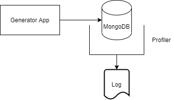

# Example project on profiling MongoDB

This project demontrats how to profile a mongo database. It uses a generator app to similate actvity on the database.

Workflow:

- Create MongoDB Server
- Generator app reads and writes data
- Profiler logs detailed information



## Create MongoDB Server

```bash

# ssh onto the machine
ssh user@server

# start the service
sudo systemctl start mongod

mongosh

# Create a perf_test db and insert an item
test> use perf_test_database
perf_test>  db.message_collection.insertOne({"Item": 1})
perf_test> db.message_collection.find()
[{ _id: ObjectId("61fb18654bc8b35163389654"), Item: 1 }]
perf_test> db.message_collection.deleteOne({"_id" : ObjectId("61fb1b084bc8b35163389657")})

# handy commands - list and drop
db.adminCommand( { listDatabases: 1 } )
db.getCollectionInfos()
db.collection.find() 
db.message_collection.drop()
db.dropDatabase()


## Enable the profiler


# start shell
mongosh

```

## Generator
The generator is a python application. 

```bash
#Run app
> python main.py --connection_string <mongo_db_connecton_string>
```
# Development

The development environment is to manages the Python Generator Code.

## Python Generator code

Setup your dev environment by creating a virtual environment

```bash
# virtualenv \path\to\.venv -p path\to\specific_version_python.exe
python3 -m venv .venv
source .venv/bin/activate

deactivate
```

## Style Guidelines

This project enforces quite strict [PEP8](https://www.python.org/dev/peps/pep-0008/) and [PEP257 (Docstring Conventions)](https://www.python.org/dev/peps/pep-0257/) compliance on all code submitted.

We use [Black](https://github.com/psf/black) for uncompromised code formatting.

Summary of the most relevant points:

- Comments should be full sentences and end with a period.
- [Imports](https://www.python.org/dev/peps/pep-0008/#imports) should be ordered.
- Constants and the content of lists and dictionaries should be in alphabetical order.
- It is advisable to adjust IDE or editor settings to match those requirements.

### Use new style string formatting

Prefer [f-strings](https://docs.python.org/3/reference/lexical_analysis.html#f-strings) over ``%`` or ``str.format``.

```python
#New
f"{some_value} {some_other_value}"
# Old, wrong
"{} {}".format("New", "style")
"%s %s" % ("Old", "style")
```

One exception is for logging which uses the percentage formatting. This is to avoid formatting the log message when it is suppressed.

```python
_LOGGER.info("Can't connect to the webservice %s at %s", string1, string2)
```

### Testing

```bash
pip3 install -r requirements_dev.txt
```

Now that you have all test dependencies installed, you can run linting and tests on the project:

```bash
isort .
codespell --skip=".venv"
black main.py 
flake8 main.py
pylint main.py
pydocstyle main.py
```


# Resources
- Mongo Profiler Docs https://docs.mongodb.com/manual/tutorial/manage-the-database-profiler/
- Mongo Shell Docs https://docs.mongodb.com/manual/reference/
- Motor - Mongo Python Driver Docs https://docs.mongodb.com/drivers/motor/
- Logistic Function https://en.wikipedia.org/wiki/Logistic_function